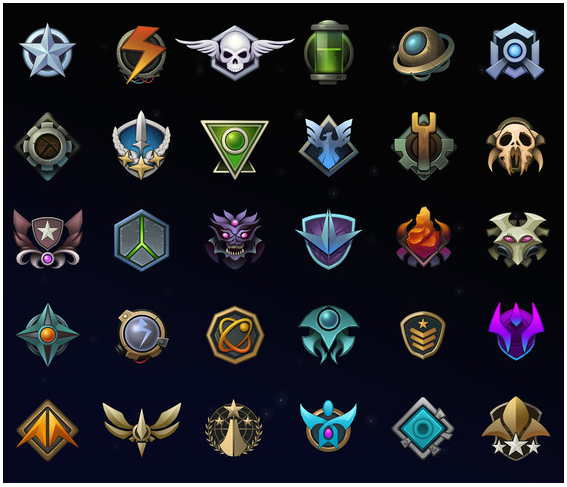
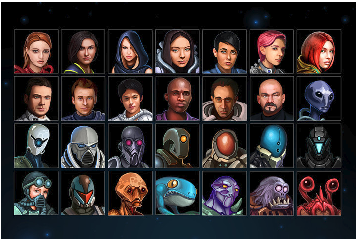
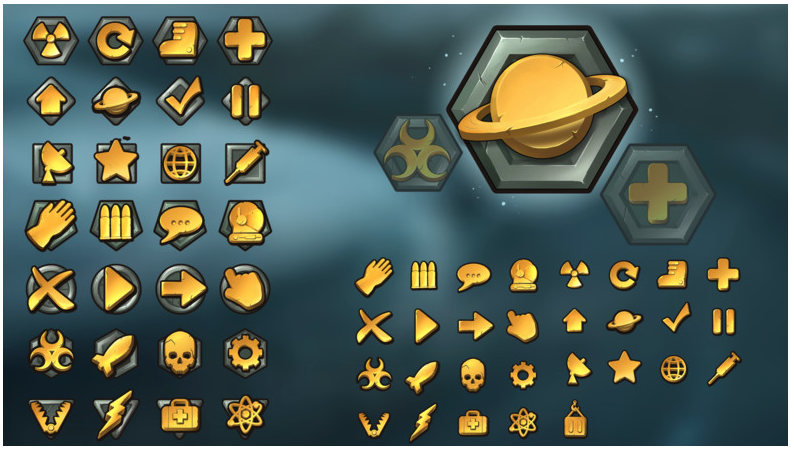
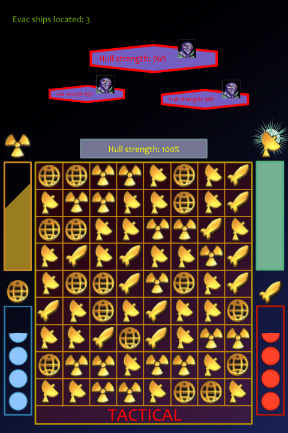
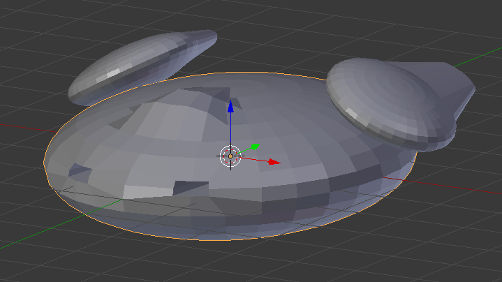

The Path of the Vigilant
===

## Game Summary:
You're the commander of the Vigilant, one of Earth's last battleships, charged with leading and protecting an evacuation fleet as they venture towards E2-C223 to begin civilization anew.  As the fleet of ships jump from point to point through space, you are attacked!  In the chaos, the individual captains of each transport ship scatter without regard for the rest of the fleet and flee through space using unique escape vectors.  Your mission still stands, though amended .. Find the missing transport ships and lead them to their new  home!

## Core Mechanics:
- Manipulate the game board such that there are three or more adjacent tiles (horizontal or vertical) with matching icons
- Boost or repair the ship's systems depending on which tiles were matched and the current active view (general, tactical, engineering, etc.)

## Gameplay:
Your ship, the Vigilant, has just entered a region of space.  The Vigilant's scanners begin powering up to search nearby for any missing ships from the evacuation fleet.  Simultaneously, the Vigilant's shields and weapons begin to charge along with the the Vigilant's hyper-propulsion engines.  You have a feeling that this is a dangerous section of space, so you prioritize matching tactical and defensive tiles to accelerate the readiness of those systems in the event that you need them.  As suspected, enemy ships appear nearby and fighting commences.  As you fire on the enemy, your weapons need to be recharged (matching tactical tiles boosts the charge speed/rate).  As you take damage, shields need to be recharged and the ship itself needs to be repaired (defensive and engineering tiles, respectively).  During the engagement with the enemy ship, the Vigilant's scanners pick up what could be a possible signal from one of the missing ships from the evac fleet (the scanners have been charging and scanning regularly with additional boosts from matching astrometrics tiles).  Now, you have a decision to make.  Continue the engagement with the enemy or ready the Vigilant's engines (navigation or engineering tiles) and jump to the signal you just scanned.  The risk of continuing the fight (on top of the risk you might lose) is that the scanned signal might degrade to a point where it's no longer detectable.  A big risk of jumping to the signal is that the enemy might follow an endanger the evacuation ship you're tasked to escort .. ___if___ the signal scanned even belonged to an evacuation ship.

## Music:
The music for most parts of the game should be moderately paced.  The tempo should increase during combat engagements.  The tempo should decrease for moments of loss (evac ship lost forever or destroyed).  The style I think should be chiptune-y .. similar to the music in _Faster Than Light_.

## Art Style:
### [Artist credit (assets from Unity Store)](https://assetstore.unity.com/publishers/13229)

Scope Check
===
## Part 1: Visualization and Implementation

### Visualization

In this mock scene, the player is engaged in combat with three enemy ships and has begun to damage them.  The player has the majority of their shields and can fire their weapons with a chance to deal a large amount of damage.  The player has also detected a signal that ___could___ be one of the missing ships from the evacuation fleet (of which, the player has already located three of the missing ships).  However, the player does not have a sufficient power to jump to that location.  At this point, the player can choose to prioritize charging their engines to jump to the detected signal or they can balance offense and defense prioritization to attempt to defeat the enemies.  As the current active HUD is TACTICAL, a bonus to weapon and shield charging is granted upon matching those three or more of those tiles in a row.

#### Scene asset list
- background
- player UI
    - progress label (number of evac ships located)
    - ship health bar
    - ship health label
- enemies
    - ship image
    - health label
    - enemy avatar
- game progress UI
    - engineering progress
    - shield re/charge progress
    - scanning progress
    - weapons re/charge progress
- game board
    - grid/frame
    - active HUD label
    - active HUD tint
- tiles
    - shields
    - weapons
    - scanning
    - engineering

#### Scene action list
- background changes on scene load
- player UI
    - evac ships located label updates
    - ship health bar reflects current health
    - ship health label reflects current health
- enemies
    - ship images reflect damage taken
    - health label reflects current health
    - explosion particles on hit??
- game progress UI
    - engineering progress
        - bar fills reflecting tile matches
        - bar flashes on 100% fill
        - icon illuminates on 100% fill
        - audible "Jump drive ready" on 100% fill
        - audible "energy engines powering up" sound
    - shield re/charge progress
        - shield icons fill reflecting tile matches
        - shield icons deplete reflecting damage taken
        - "shields restored" HUD flash on icon fill
        - audible "Level # shields restored" on icon fill
        - audible "energy shield powering up" sound
    - scanning progress
        - bar fills reflecting tile matches
        - bar flashes on 100% fill
        - scan icon illuminates on 100% fill
        - audible "Communications signal detected" on 100% fill
        - detected signal degrades over time .. once gone, the scanning restarts
    - weapon re/charge progress
        - weapon icons fill reflecting tile matches
        - weapon icons deplete reflecting weapons fired
        - weapon icon illuminates reflecting ready to fire
        - audible "Level # weapons ready" on icon fill
        - audible "energy weapons powering up" sound
- game board
    - active HUD label reflects the current active HUD
    - active HUD tint reflects the current active HUD
- tiles
    - audio on match
    - matching tiles flash on match
        - distinct flash for each tile type??

#### Player action list
- player moves tiles up to one space away
    - limited to vertical and horizontal movement
    - limited to game board boundaries
    - if the move results in 3 or more identical tiles lined up in a row (horizontal or vertical), then:
        - the tiles are removed
        - any tiles above the removed tiles shift down with new tiles randomly generated at the top
        - the mechanic related to the matched tiles is triggered (see game progress UI above)
    - if the move does not result in 3 or more identical tiles lined up in a row (horizontal or vertical), then the tiles are returned to their previous states
- player swipes to change the active HUD to grant bonuses to value received from matching corresponding tiles (HUD label and tint will change indicating active HUD

### Implementation

I have coded and created similar type of mechanics listed above with the exceptions of the "match-3" mechanic and the change of HUD on swipe.  In a previous Ludum Dare, I produced a game where the player would simply click a tile to remove it .. left clicks produced a different result than right clicks.  All of my games so far have been single scene, so transitioning between scenes will also be new to me with respect to coding.

[Quill18](https://www.youtube.com/user/quill18creates) has a video playlist about IDraggable and it's uses with card games like Hearthstone, etc.

[MisterTaftCreates](https://www.youtube.com/channel/UCZczqDvepgNqy80gTMGnUXw) created [this playlist](https://www.youtube.com/playlist?list=PL4vbr3u7UKWrxEz75MqmTDd899cYAvQ_B) specifically on creating a match-3 type of game.

Assets that could be used:
- [Candy Match 3 Kit](https://assetstore.unity.com/packages/templates/systems/candy-match-3-kit-111083)
- [Ultimate Match Three](https://assetstore.unity.com/packages/templates/systems/ultimate-match-three-95542)

For the most part, I would be working solo on this with the possibility of family members helping with art assets.  As a software developer by trade, I'm more than comfortable coding and researching development items.  The match-3 algorithm is something that I'd have to research and implement if I don't purchase an existing asset, but there are existing tutorials on that subject.  The same is true for scene transitioning.

#### Visual assets
- background
- player UI
    - progress label (number of evac ships located)
    - ship health bar (sliding bar)
    - ship health label
- enemies
    - ship image (what if this was 3d asset with fixed camera angle?)
    - health label/bar (sliding bar)
    - enemy avatar
    - explosion particles on hit??
- game progress UI
    - engineering progress (sliding bar)
    - shield re/charge progress (filling icons)
    - scanning progress (sliding bar)
    - weapons re/charge progress (filling icons)
    - bars flash on 100% fill
    - icons flash/illuminate on 100% fill
    - weapon icon illuminates reflecting ready to fire
- game board
    - grid/frame
    - active HUD label
    - active HUD tint
- tiles
    - shields
    - weapons
    - scanning
    - engineering
    - matching tiles flash on match
        - distinct flash for each tile type??

#### Audio assets
- background music
- enemies
    - explosion particles on hit??
- game progress UI
    - engineering progress
        - audible "Jump drive ready" on 100% fill
        - audible "energy engines powering up" sound
    - shield re/charge progress
        - audible "Level # shields restored" on icon fill
        - audible "energy shield powering up" sound
    - scanning progress
        - audible "Communications signal detected" on 100% fill
        - detected signal degrades over time .. once gone, the scanning restarts
    - weapon re/charge progress
        - audible "Level # weapons ready" on icon fill
        - audible "energy weapons powering up" sound
- tiles
    - audio on match

#### Sample self-made art asset

Between self-made and [purchased assets](https://assetstore.unity.com/publishers/13229) (both visual and audio), I believe I can finish with a resonable degree of quality.  The biggest challenge, for me, is the match-3 algorithm and implementation.

## Part 2: Scale, Challenges and Resources

### Scale

The game as a whole consists of:
- 1 jump chart
- 20 jump points (where evac ships and enemies ___could___ be found .. no bonus/penalty beyond that)
- 5 different evac ships (model only)
- 3 different enemy ships (model only)
- 4 different tile types to match
- 4 different HUD UIs (grants bonus to matching depending on which HUD is active)

Minimum viable product would consist of:
- no jump chart
- no selectable jump points (random encounters based on jumping to scanned signals)
- 1 different evac ships (model only)
- 1 different enemy ships (model only)
- 4 different tile types to match
- 1 different HUD UIs with no bonus/penalty to matches

### Challenges
My top 3 challenges are:
- How difficult is it to implement the match-3 pattern?
- Can I budget enough time to complete more than the MVP?
- How much leeway will I allow myself to give for work and family priorities?

### Resources
I can commit to ___at most___ three to four hours on weekdays and ___at most___ six to twelve hours on weekends due to work and family obligations.  Taking the minimum of these, that calculates out to be 160 hours total.  I believe that this does include a buffer for the unexpected (outside of severe emergencies/situations).

Tutorial links
- [MisterTaftCreates match-3 playlist](https://www.youtube.com/playlist?list=PL4vbr3u7UKWrxEz75MqmTDd899cYAvQ_B)
- [Unity3D UI playlist](https://www.youtube.com/playlist?list=PLC9dx4ypVr2J29fQEX3Z45Fhn41Wj6xbG)
- [Quill18Creates drag & drop playlist](https://www.youtube.com/playlist?list=PLbghT7MmckI42Gkp2cILkO2nRxK2M4NLo)

## Part 3: Reality Check

### Assessment
I am confident that I can create this game that's been in my head for ___at least___ the past 9 months.  As I stated in my "introduce yourself" forum post, I'm hoping that I pick up the prioritization and scope creep avoidance skills I need while completing this course.  I'm no stranger to software development and the "work horse" of this game is the match-3 mechanic.  Once the mechanic is implemented, the rest is all UI and audio (areas in which I expect to spend the majority of my time and effort).